# 一、git分别提交到master分支和dev分支

### 1.推送到master分支

初始化：git init

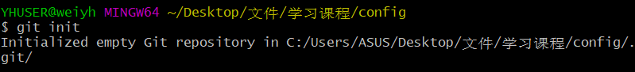

添加到本地暂存区：git add .

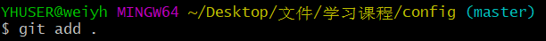

添加备注：git commit -m "备注"

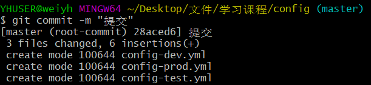

本地与远程关联：git remote add origin https://gitee.com/cnwanj/springcloud-config.git

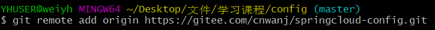

推送到远程master分支：git push -u origin master

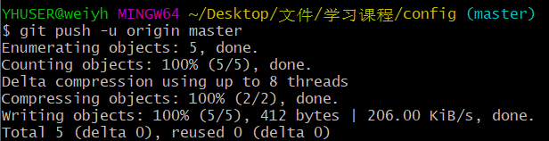

==注意：若发生如下报错==

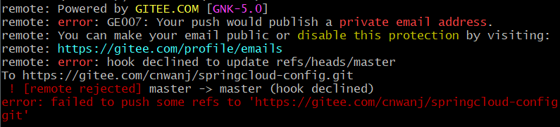

可以开启gitee中的邮箱权限，把打勾去掉如下：

### 2.推送到dev分支

新建本地分支：git checkout -b dev

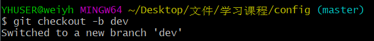

新建后会自动切换到分支，也可以切换分支如下：git checkout dev

添加到本地暂存区：git add .

查看git操作状态：git status

添加备注：git commit -m "备注"

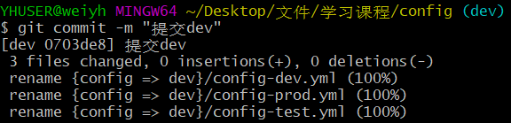

推送到远程dev分支：git push -u origin dev

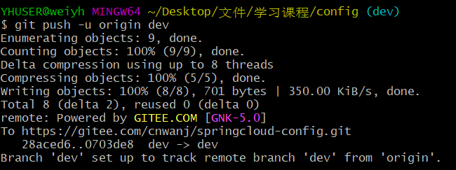

#### master分支：

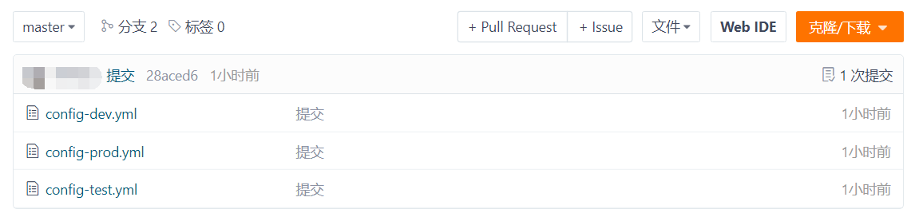

#### dev分支：

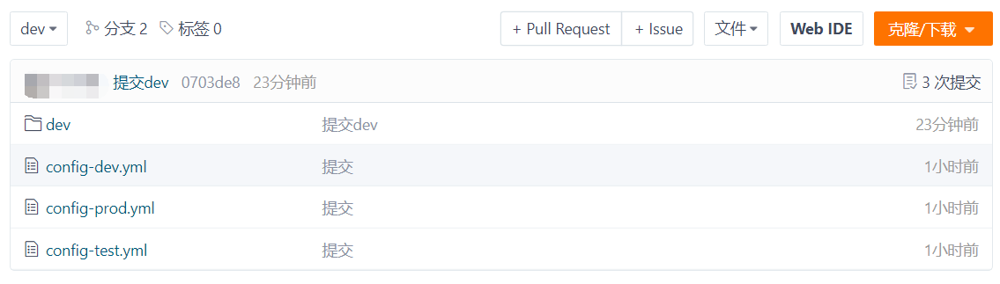