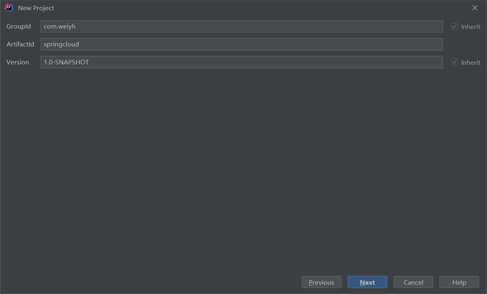
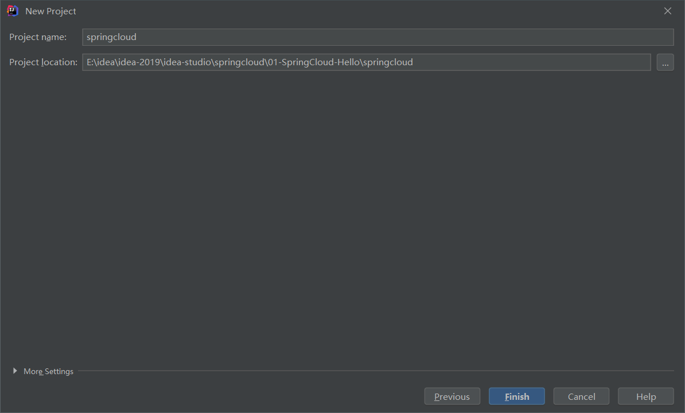

# 一、Eureka服务注册中心

springcloud中文文档：https://www.springcloud.cc/spring-cloud-dalston.html#_circuit_breaker_hystrix_clients		

​		每个微服务都会向注册中心去注册自己的地址及端口信息，注册中心维护着服务名称与服务实例的对应关系。每个微服务都会定时从注册中心获取服务列表，同时汇报自己的运行情况，这样当有的服务需要调用其他服务时，就可以从自己获取到的服务列表中获取实例地址进行调用，Eureka实现了这套服务注册与发现机制。

## 1.搭建Eureka服务端

创建Maven父工程





父工程pom.xml文件：

```xml

```

