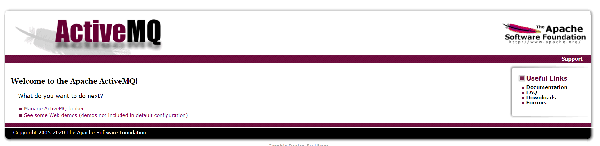
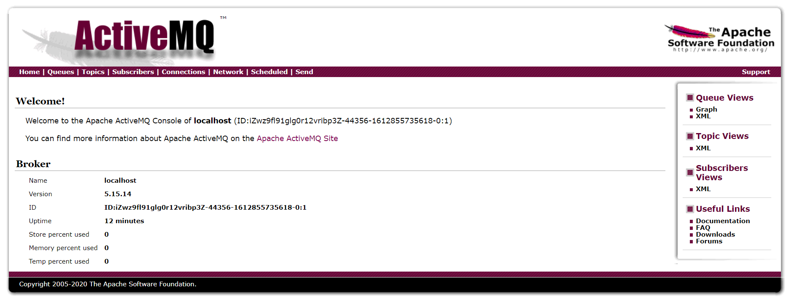
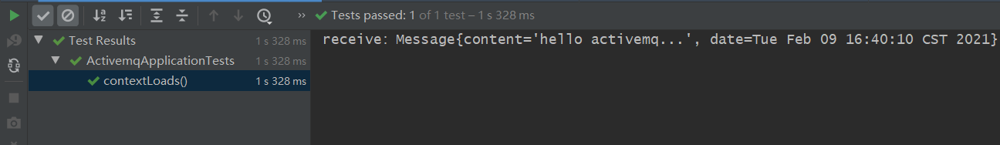
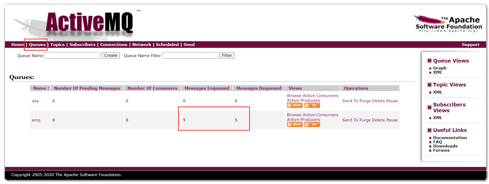
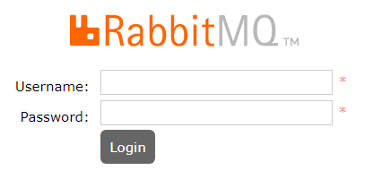
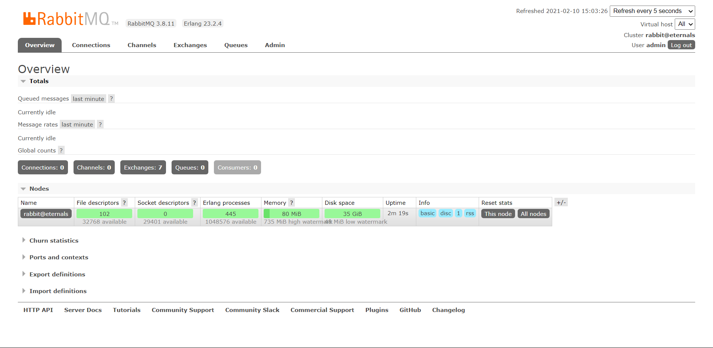
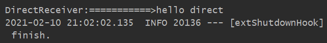
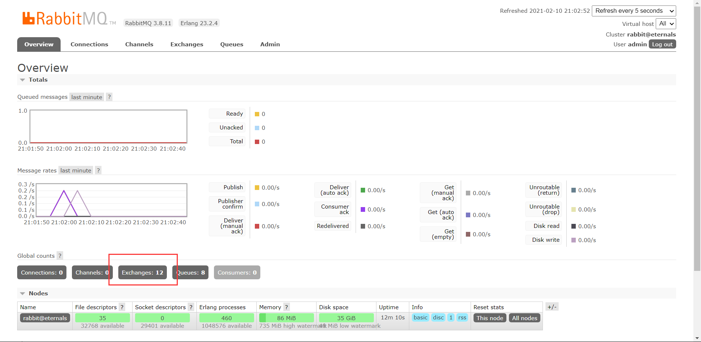
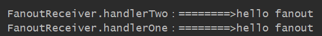

# 一、消息队列MQ（Message Queue）

>  参考书籍：《Spring Boot+Vue全栈开发实战》

消息队列（ Message Queue ）是种进程间或者线程间的异步通信方式，消息生产者在产生消息后，会将消息保存在消息队列中，直到消息消费者来取走它 ，即消息的发送者和接收者不需要同时与消息队列交互，使用消息队列可以有效实现服务的解耦，并提高系统的可靠性以及可扩展性。

## 1. JMS（Java Message Service）

JMS（Java Message Service）Java消息服务，字面上来看，是仅支持Java平台，消息服务，无非就是对外提供服务，也就是提供API。它通过统一JAVA API层面的标准，使得多个客户端可以通过JMS进行交互，大部分消息中间件提供商都对JMS提供支持，JMS和ActiveMQ的关系就像JDBC和JDBC驱动的关系。JMS包括两种消息模型：点对点和发布者/订阅者。

### 1.1ActiveMQ整合SpringBoot

由于 JMS 是一套标准，因此 Spring Boot 整合 JMS 必然就是整合 JMS 的某一个实现，本案例以ActiveMQ 为例来看 Spring Boot 如何进行整合。

#### 1.1.1 ActiveMQ简介

Apache ActiveMQ是个开源的消息中间件，它不仅完全支持 JMS1.1规范，而且支持多种编程语言，同时还提供了对spring框架的支持，以及集群的支持。

#### 1.1.2 ActiveMQ安装

ActiveMQ都是安装在Linux上的，因此，本案例的安装环境为CentOS 7, ActiveMQ版本为15.4.14 ，安装步骤如下（注意，要运行ActiveMQ，CentOS 上必须安装 Java 运行环境）

```shell
# 1.下载ActiveMQ
wget http://mirrors.hust.edu.cn/apache//activemq/5.15.14/apache-activemq-5.15.14-bin.tar.gz

# 2.解压下载文件
tar -zxvf apache-activemq-5.15.14-bin.tar.gz

# 3.启动ActiveMQ
cd apache-a
ctivemq-5.15.14
cd bin/
./activemq start

# 查看ActiveMQ的状态
./activemq status
# 停止ActiveMQ
./activemq stop
```

启动成功后，在浏览器输入http://localhost:8161，8161ActiveMQ 默认端口号，这时候需要进行登录，默认账号密码都是admin，登录成功后如下：



点击"Manage ActiveMQ broker"链接进入管理员控制台，如下：



#### 1.1.3 整合SpringBoot

Spring Boot ActiveMQ 置提供了相关的“ Starter ”，因此整合非常容易。首先创建 Spring Boot 项目，添加 ActiveMQ 依赖，pom.xml代码如下：

```xml
<dependency>
    <groupId>org.springframework.boot</groupId>
    <artifactId>spring-boot-starter-activemq</artifactId>
</dependency>
```

配置文件application.yml如下：

```yml
spring:
  activemq:
    # 配置broker地址，默认端口为61616
    broker-url: tcp://localhost:61616
    packages:
      # 支持发送对象消息
      trust-all: true
    # ActiveMQ的账号和密码
    user: admin
    password: admin
```

自定义消息类，如下：

```java
public class Message implements Serializable {

    private String content;
    private Date date;
 	
    // 省略get set toString...
}
```

接下来在项目创建一个Jms组件，如下：

```java
@Component
public class JmsComponent {

    // spring提供的消息发送模板
    @Autowired
    JmsMessagingTemplate jmsMessagingTemplate;

    /**
     * 消息发送，目标为"target"的消费者将接收到该消息
     * @param msg
     */
    public void send(Message msg) {
        jmsMessagingTemplate.convertAndSend(new ActiveMQQueue("target"), msg);
    }

    /**
     * 消息消费者订阅的目标为"target"
     * @param msg
     */
    @JmsListener(destination = "target")
    public void receive(Message msg) {
        System.out.println("receive：" + msg);
    }
}
```

测试类中调用JmsComponent组件进行消息发送，如下：

```java
@SpringBootTest
class ActivemqApplicationTests {

    @Autowired
    JmsComponent jmsComponent;

    @Test
    void contextLoads() {
        // 实例化自定义消息类
        Message msg = new Message();
        msg.setContent("hello activemq...");
        msg.setDate(new Date());
        // 发送消息
        jmsComponent.send(msg);
    }

}
```

成功后输出如下：



在控制面板中可以看到发送的消息个数：



## 2. AMQP（Advanced Message Queue Protocol）

AMQP（Advanced Message Queue Protocol）高级消息队列协议。协议无非就是需要遵循一定的数据规范，是在线路层上建立的，也就是应用层协议的一个开放标准，定义了网络交互的数据格式，而不是API接口（例如JMS），这使得AMQP和JMS从本质上的区别。它天然就是跨平台的，就像SMTP、HTTP 等协议样，只要开发者按照规范的格式发送数据，任何平台都可以通过AMQP进行消息交互。像目前流行的 StormMQ、RabbitMQ 等都实现了 AMQP。

### 2.1RabbitMQ整合SpringBoot

和JMS一样，使用 AMQP 也是使用 AMQP 的某个实现。

#### 2.1.1RabbitMQ简介：

RabbitMQ是一个实现了 AMQP 的开源消息中间件，使用高性能的 Erlang 编写。 RabbitMQ具有可靠性、支持多种协议、高可用、支持消息集群以及多语言客户端等特点，在分布式系统中存储转发消息，具有不错的性能表现。

#### 2.1.2 RabbitMQ安装：

参考链接：[https://www.helloweba.net/server/624.html](https://www.helloweba.net/server/624.html)

由于RabbitMQ使用Erlang编写，安装 RabbitMQ 之前要安装 Erlang，需要先到[RabbitMQ官网](https://www.rabbitmq.com/which-erlang.html)看下版本对应关系。可以分别在[Erlang的Github](https://github.com/rabbitmq/erlang-rpm/releases)和[RabbitMQ官网](https://www.rabbitmq.com/install-rpm.html#downloads)下载对应的版本的rpm包。下载步骤如下：

```shell
# 下载erlang
wget https://github.com/rabbitmq/erlang-rpm/releases/download/v23.2.4/erlang-23.2.4-1.el7.x86_64.rpm

# 下载rabbitmq
wget https://github.com/rabbitmq/rabbitmq-server/releases/download/v3.8.11/rabbitmq-server-3.8.11-1.el7.noarch.rpm

# 安装socat依赖，安装Erlang时需要
yum install -y socat

# 安装Erlang
rpm -ivh erlang-22.2-1.el7.x86_64.rpm

# 查看Erlang安装版本
erl -version

# 6.安装RabbitMQ
rpm -ivh rabbitmq-server-3.8.1-1.el7.noarch.rpm

# 启动rabbitmq
systemctl start rabbitmq-server 或 service rabbitmq-server start

# 查看状态
rabbitmqctl status

# 启用网页版后台管理插件
rabbitmq-plugins enable rabbitmq_management

# 重启rabbitmq
systemctl restart rabbitmq-server 或 service rabbitmq-server restart

#添加一个用户名为admin，密码为admin的用户
rabbitmqctl add_user admin admin

#设置admin用户的角色为管理员
rabbitmqctl set_user_tags admin administrator

#配置admin用户可以远程登录
rabbitmqctl set_permissions -p / admin ".*" ".*" ".*"
```

rabbitmq其他常用操作：

```shell
# 可以设置rabbitmq开机自启
systemctl enable rabbitmq-server

# 关闭服务
rabbitmqctl stop
```

插件管理：

```shell
#插件列表： 
rabbitmq-plugins list 

#启动插件： 
rabbitmq-plugins enable XXX   （XXX为插件名）

#停用插件： 
rabbitmq-plugins disable XXX
```

RabbitMQ启动成功后，默认有一个guest用户，但是该用户只能在本地登录，无法远程登录，因此本案例中添加了一个新的用户sang，也具有管理员身份，同时可以远程登录。当RabbitMQ启动成功后，在物理机浏览器上输入虚拟机地址: http://localhost:15672，15672是RabbitMQ的默认端口，如下：



登录admin如下：



#### 2.1.3 整合SpringBoot 

Spring Boot为AMQP提供了自动化配置依赖spring-boot-starter-amqp ，因此首先创建Spring Boot项目并添加该依赖，如下：

```xml
<dependency>
    <groupId>org.springframework.boot</groupId>
    <artifactId>spring-boot-starter-amqp</artifactId>
</dependency>
```

配置RabbitMQ连接信息如下：

```yml
spring:
  rabbitmq:
    # rabbitmq地址、端口、用户名、密码
    host: localhost
    # 注意：该端口不是15672
    port: 5672
    username: admin
    password: admin
```

由于所有的消息生产者提交的消息都会交由Exchange进行再分配，Exchange会根据不同的策略将消息分发到不同的Queue 中。RabbitMQ中一共提供了4种不同的Exchange策略，分别是 Direct、Fanout、Topic以及Header，这4种不同的策略中前3种的使用频率较高，第4种的使用频率较低，下面分别对这4种不同的ExchangeType予以介绍。

##### (1) Direct直接交换

Direct的策略是将消息队列绑定到DirectExchange上，即将消息转发到与该条消息key相同的Queue中，例如该队列的名称为"queue-name"，监听的key为"queue-name"的消息会被该消息队列接收。RabbitMQDirectConfig如下：

```java
@Configuration
public class RabbitMQDirectConfig {

    public final static String DIRECTNAME = "weiyh-direct";

    @Bean
    Queue queue() {
        // 队列名称，用于接收者监听
        return new Queue("queue-name");
    }

    @Bean
    DirectExchange directExchange() {
        // 消息名称，重启后是否有效，长期未用是否删除
        return new DirectExchange(DIRECTNAME, true, false);
    }

    @Bean
    Binding binding() {
        // 将队列以direct的方式进行绑定
        return BindingBuilder.bind(queue()).to(directExchange()).with("direct");
    }
}
```

消息消费者DirectReceiver如下：

```java
@Component
public class DirectReceiver {
    // 监听的队列名称
    @RabbitListener(queues = "queue-name")
    public void handler(String msg) {
        System.out.println("DirectReceiver：" + msg);
    }
}
```

在测试类中注入RabbitTemplat 对象来进行消息发送，如下：

```java
@SpringBootTest
class RabbitmqApplicationTests {
    @Autowired
    RabbitTemplate rabbitTemplate;

    @Test
    void contextLoads() {
        System.out.println("nihao");
        rabbitTemplate.convertAndSend("queue-name", "===========>hello direct");
    }
}
```

记得启动RabbitMQ，然后在启动测试类，成功输出如下：



RabbitMQ控制台可以看到：



##### (2) Fanout扇形交换

Fanout的策略是把所有到达FanoutExchange的消息转发给所有与它绑定的Queue，这个过程中key不起任何作用。创建两个Queue，将两个Queue绑定到FanoutExchange中，如下：

```java
@Configuration
public class RabbitMQFanoutConfig {

    public final static String FANOUTNAME = "weiyh-fanout";

    @Bean
    FanoutExchange fanoutExchange() {
        return new FanoutExchange(FANOUTNAME, true, false);
    }

    @Bean
    Queue queueOne() {
        return new Queue("queue-one");
    }

    @Bean
    Queue queueTwo() {
        return new Queue("queue-two");
    }

    @Bean
    Binding bindingOne() {
        // 将队列queueOne绑定到fanoutExchange中
        return BindingBuilder.bind(queueOne()).to(fanoutExchange());
    }

    @Bean
    Binding bindingTwo() {
        // 将队列queueTwo绑定到fanoutExchange中
        return BindingBuilder.bind(queueTwo()).to(fanoutExchange());
    }
}
```

创建两个消费者如下：

```java
@Component
public class FanoutReceiver {

    @RabbitListener(queues = "queue-one")
    public void handlerOne(String msg) {
        System.out.println("FanoutReceiver.handlerOne：" + msg);
    }

    @RabbitListener(queues = "queue-two")
    public void handlerTwo(String msg) {
        System.out.println("FanoutReceiver.handlerTwo：" + msg);
    }
}
```

测试：

```java
@SpringBootTest
class RabbitmqApplicationTests {
    @Autowired
    RabbitTemplate rabbitTemplate;

    @Test
    void contextLoads() {
        // exchange策略名称，key为null，发送内容
        rabbitTemplate.convertAndSend(RabbitMQFanoutConfig.FANOUTNAME, null,
        	"========>hello fanout");
    }
}
```

注意：这里发送消息时不需要key，指定exchange即可，key为null。

一条消息发出后，所有与fanout绑定的Queue都接收到了消息，输出如下：



##### (3) Topic主题交换

##### (4) Header首部交换
